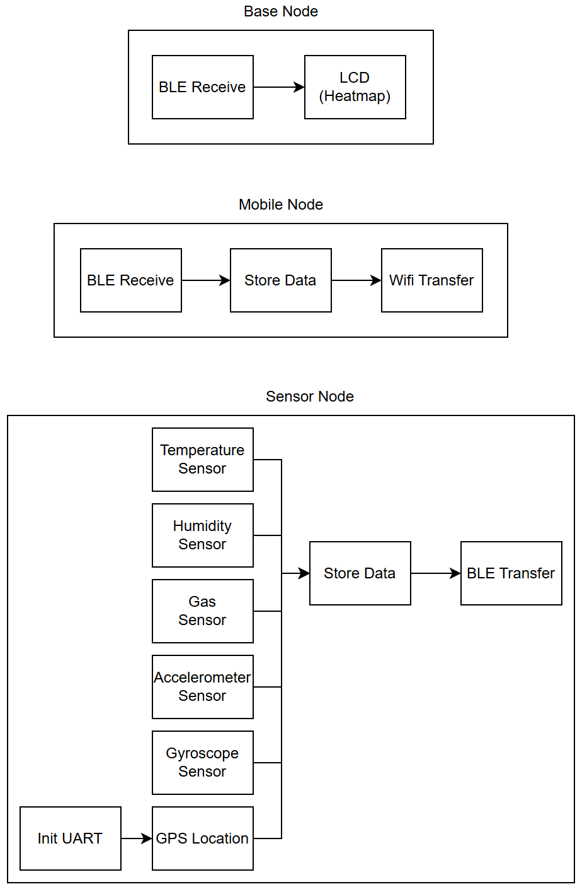
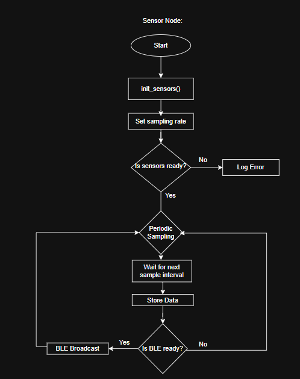
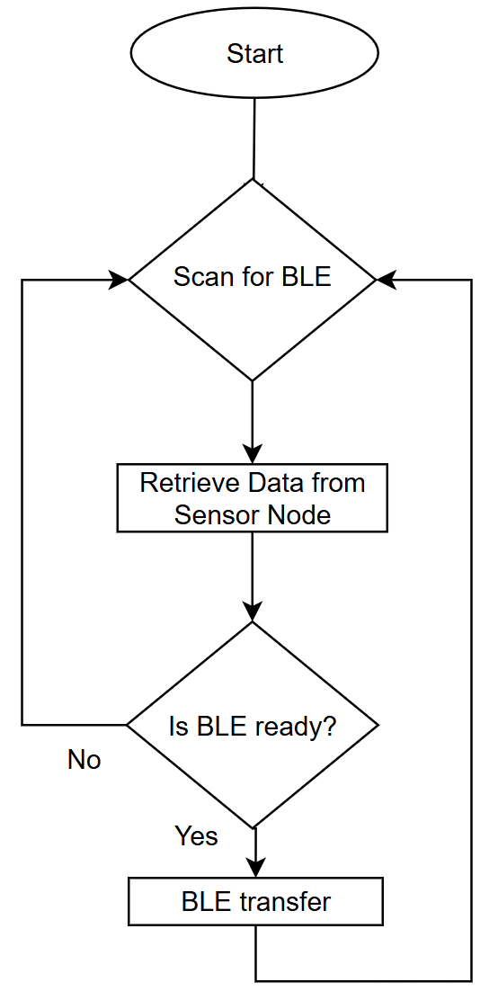
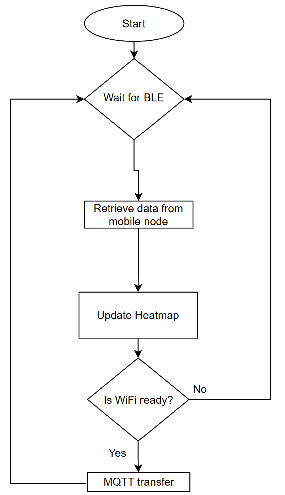

# Salamis-Salmon
Disaster Relief Sensor Mapping - The system is designed to collect critical environmental and structural data from sensor nodes deployed throughout the area.

# Deliverables and Key Performance Indicators (KPIs)
1. Mobile Node with BLE, GPS, NFC: Less then 2s average connection time to sensor nodes; Accurate geotagging within +- 3m.
2. Environmental Heatmap & Activity Dashboard: Updates within 5s of new data received; supports visualisation of atleast 2 sensor nodes.
3. Web Based Dashboard: Accessible in realtime, can visualise all data.
4. Sensor reading accuracy: Within +-5% calilbrated reference on datasheet
5. BLE broadcast interval: Broadcasts atleasts once every 5 seconds +- 10%.

# System Overview:

# Sensor Integration

SAM-M8Q (GPS Board) Using UART
AWR1843 mmWave Boost Radar Using SPI
Thingy52: BME680, Temperature and Humidity sensor using I2C

# Wireless Network Communications, Iot Protocols/Web Dashboards

# DIKW Pyramid
Data: Raw sensor readings 

Information: Timestamped and geotagged data logs

Knowledge: Heatmaps showing gas build-up or unstable areas

Wisdom: Emergency teams prioritise zones based on trends (e.g., rising CO₂ + detected motion → possible collapse risk)

# Project Software/Hardware management.

# Equipment
Thing52, M5 Core2, SAM-M8Q (GPS Board), WR1843 mmWave Boost Radar, nrf52840 DK, Speaker